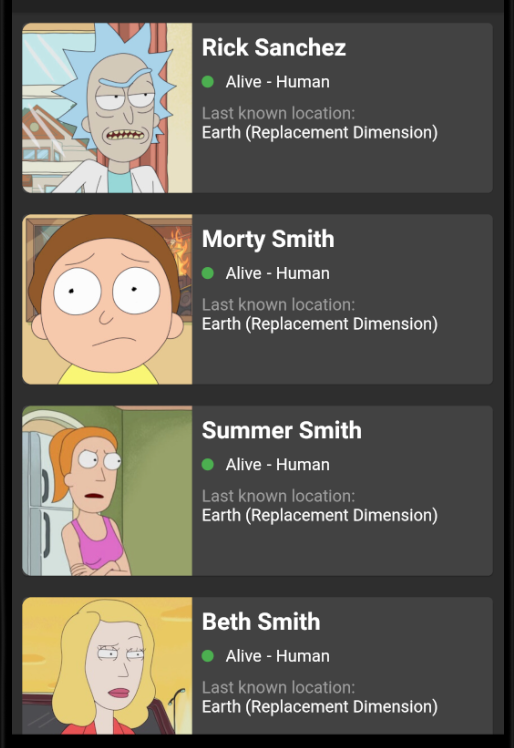

# Rick and Morty Compose

 

Display of characters from the animated series Rick and Morty

<p>

</p>

## Architecture

- [MVVM](https://ru.wikipedia.org/wiki/Model-View-ViewModel)
- [Clean-Architecture](https://blog.cleancoder.com/uncle-bob/2012/08/13/the-clean-architecture.html)
- [Use Case](https://en.wikipedia.org/wiki/Use_case)

## Technologies

- [Kotlin](https://kotlinlang.org) - %100 Kotlin
- [Gradle Kotlin DSL](https://docs.gradle.org/current/userguide/kotlin_dsl.html)
- [Coroutines](https://github.com/Kotlin/kotlinx.coroutines) for asynchronous operations
- [Lifecycle-ktx](https://developer.android.com/kotlin/ktx)
- [ViewModel](https://developer.android.com/topic/libraries/architecture/viewmodel)
- [Navigation](https://developer.android.com/guide/navigation)
- [Dagger Hilt](https://developer.android.com/training/dependency-injection/hilt-android) for Dependency Injection
- [Retrofit](https://github.com/square/retrofit) for network operations
- [OkHttp](https://github.com/square/okhttp)
- [Moshi Conver](https://github.com/square/moshi) json converter
- [Coil](https://coil-kt.github.io/coil/compose/) for image loading
- [Api](https://rickandmortyapi.com/documentation/#get-all-characters)

## License

```
Copyright 2022 [KsArT](https://github.com/KsArt-IT/).

Licensed under the Apache License, Version 2.0 (the "License");
you may not use this file except in compliance with the License.
You may obtain a copy of the License at

    http://www.apache.org/licenses/LICENSE-2.0

Unless required by applicable law or agreed to in writing, software
distributed under the License is distributed on an "AS IS" BASIS,
WITHOUT WARRANTIES OR CONDITIONS OF ANY KIND, either express or implied.
See the License for the specific language governing permissions and
limitations under the License.
```
